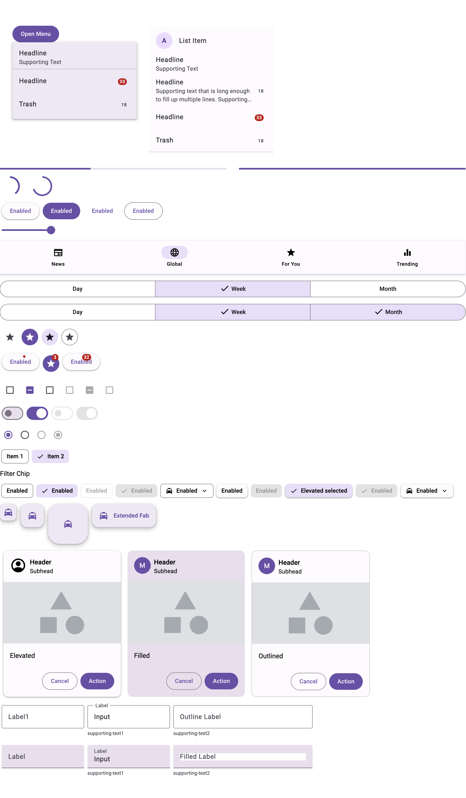

# Vue Material 3

<p align="center">
    <a href="https://www.npmjs.com/package/vue-material-3">
        
    </a>
    <a href="https://www.npmjs.com/package/vue-material-3">
        
    </a>
    <a href="https://www.npmjs.com/package/vue-material-3">
        
    </a>
    <a href="https://www.npmjs.com/package/vue-material-3">
        
    </a>
</p>

> IMPORTANT: Vue Material 3 is a work in progress and subject to major changes until 1.0 release.

The Vue Material 3 provides Vue 3 components which implement the [Material You](https://material.io/blog/announcing-material-you) (Material Design 3) specs and tools for building beautiful apps.

### Components
- [ ] Autocomplete
- [x] Badge
- [x] Buttons
- [x] Cards 
- [x] Checkbox 
- [ ] Chips [WIP]
- [ ] Date Picker
- [x] Dialog
- [x] Divider
- [x] FABs 
- [x] Icon
- [x] Icon Button
- [x] List
- [ ] Menu
- [x] Navigation Bars
- [x] Navigation Drawer
- [ ] Navigation Rail
- [x] Progress Indicator
- [x] Radio Button
- [ ] Search
- [x] Segmented Button
- [ ] Slider
- [ ] Snackbar
- [x] Switch
- [ ] Tabs
- [x] Text Fields
- [x] Time Picker
- [ ] Top App Bar



### Quick Start

Install vue-material-3 using npm or yarn:

```bash
npm install vue-material-3 --save
yarn add vue-material-3
```

Then use in your template:

```vue
<template>
  <div>
    <md-elevated-button>It works!</md-elevated-button>
  </div>
</template>

<script>
import { defineComponent } from "vue";
import { MdElevatedButton } from "vue-material-3";

export default defineComponent({
  components: {
    MdElevatedButton,
  },
});
</script>
```

## License

MIT
